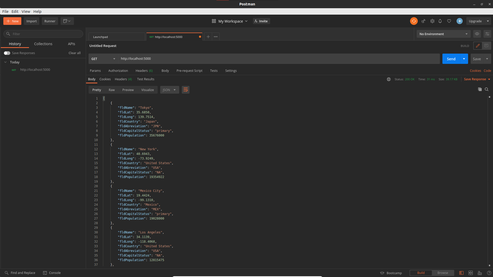
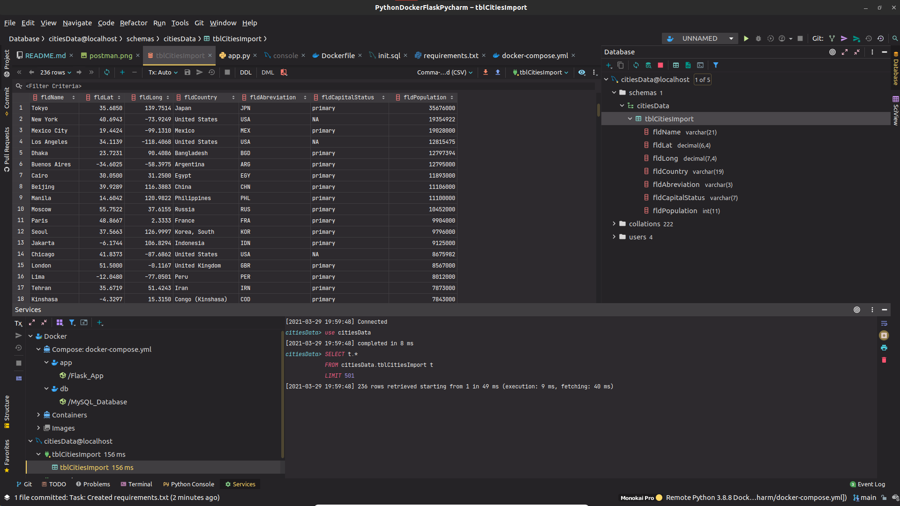

# PythonDockerFlaskPycharm
# Project Description
This project is a homework assignment to teach how to get Pycharm set up with Docker, Flask, MySQL, and Postman
# Postman Screenshot

# Pycharm Database Screenshot
